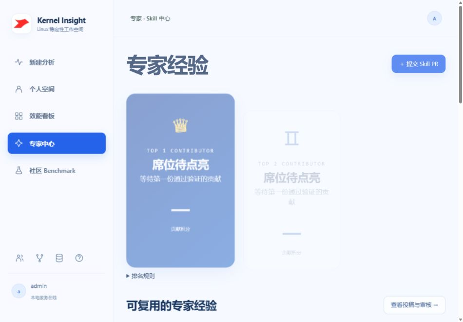

# Kernel Insight

Linux 稳定性分析工作空间：社区案例 Benchmark、精确版本内核源码缓存、专家经验与 Skill 审核、个人任务进度和效能看板。

## 快速启动

需要 Node.js 22.14+ 与系统 `tar`（Windows 自带 bsdtar）。

```powershell
npm ci
npm run setup:diagrams
npm start
```

打开 [本地工作台](http://localhost:8787)。服务默认仅监听 `127.0.0.1:8787`。首次启动创建 `admin / admin` 管理员账号；登录页面不展示默认账号提示。普通注册账号默认为测试人员，管理员在账号管理中设置身份。

`setup:diagrams` 为 Windows 下载并校验本地 Java / PlantUML；其他系统可以通过 `PLANTUML_JAVA` 与 `PLANTUML_JAR` 指定已有运行环境。Markdown 和 Mermaid 使用本地依赖，无需外部 CDN。源码和社区日志采集需要网络。

```powershell
npm test
npm run collect:benchmark
```

当前 24 项自动验收测试全部通过，覆盖账号权限、任务归属、真实进度、分析去重、Benchmark 门禁、源码校验与安全解压、Markdown、PlantUML 和真实评分。

## 页面与使用流程

| 页面 | 功能 |
| --- | --- |
| 新建分析 `#/workbench` | 单屏输入与上传，支持最多 20 个文件、每个 64 MB；展开选项选择推荐或指定 Skill、源码参数和重新分析 |
| 个人空间 `#/personal` | 自己的日志任务、社区试跑、跑分历史和 Skill 投稿；顶部三个卡片跳转相应列表，展开任务查看阶段时间轴 |
| 效能看板 `#/overview` | 人工确认解决数、实际耗时、配对人工基线改善率和问题分布 |
| 专家中心 `#/skills` | 从左到右 TOP 1 / 2 / 3，卡片翻转、首席点击烟花；搜索经验，查看贡献者、解决数与满意度 |
| 社区 Benchmark `#/benchmark` | 案例来源、日志、根因摘要与修复依据；就地试跑及查看报告 |
| Skill 合入流程 `#/skills/pulls/` | 投稿、管理员审核、提交者手动测试、无退化合入及活动记录 |
| 账号管理 `#/users` | 仅管理员可见，分配测试人员、专家、领导或管理员身份 |

首次登录按身份进入相应页面；已登录刷新保留当前路由。任务和投稿按服务端用户 ID 隔离。报告记录实际命中的 Skill、版本与贡献者。

## Skill 能力守护

创建投稿时冻结社区案例与一个正常日志负例。审核通过后，提交者手动触发固定 Benchmark；管理员可记录原因并跳过审核，但不能跳过测试。刷新或打开页面不会启动测试，同一时间最多运行一个 Benchmark。

合入要求原本正确的案例不退化、整体类别得分不降低、候选规则有正确命中且没有误匹配。测试后基准 Skill 集合变化会阻止合入，需重新测试。当前评分是有限案例上的类别检索精确率、召回率和 F1，不是完整根因定位准确率。

专家排名按解决能力 50%、真实使用次数 25%、候选 Skill Benchmark F1 25% 计算。社区试跑不计业务贡献；没有已合入贡献者时展示空席位。满意度取人工评价中 4 / 5 星占比，按问题签名去重，没有评价显示 `—`。

## Benchmark 与源码

[data/benchmark](data/benchmark) 包含 6 份真实 syzbot 原始 crash report、4 类异常、3 个测试样本，版本为 `linux-community-v1`。清单保存来源、修复 commit、源码版本 / commit、SHA256 和 train/test 标记。根因摘要依据社区修复说明整理，尚未本地复现。

采集使用官方 syzbot.org；源码优先日志 commit，否则使用准确官方 release，发行版或厂商后缀不会静默降级。支持 Mainline、Stable、Linux-next 对应仓库。官方发布包校验官方 SHA256；commit 快照通过 HTTPS 下载并记录本地 SHA256。两路并发下载、状态持久化和缓存复用；Windows 将安全内核符号链接物化为文件副本或 junction。

## 重复分析与统计

同一账号下，规范化日志、Skill 内容 / 版本 / 顺序、组合、源码条件、下载选项、Benchmark 和分析引擎相同的请求共享任务：运行中跟随进度，完成后复用报告。记录重复提交次数、文件名和机器批次。失败任务不复用；条件改变创建新任务；显式重新分析仅对已完成任务生效。旧任务缺少条件指纹，升级后首次提交会新建一次。

近似问题签名只提供关联提示，不自动复用分析。只有人工确认计入解决数，平均耗时包含提交至确认的等待时间。改善率只使用填写人工基线的配对样本，无样本显示 `—`。

## 数据与实现边界

当前分析为确定性规则分诊和社区案例检索，尚未接入 LLM / Codex worker，也不自动证明根因或复现故障。实时状态反映实际服务端处理阶段。上传 Skill 是声明式文本规则与经验正文，不执行上传脚本。

运行数据保存在 `data/state.json`、`data/accounts.json`、`data/uploads`、`data/reports`、`data/skill-pulls`；源码和图表运行环境为本地缓存。这些目录由 `.gitignore` 排除，GitHub 仅发布代码、公开 Benchmark 与设计文档。测试使用临时独立目录。

## 设计与交接

最新设计使用浅蓝双光束背景、蓝色主操作、高对比度文字，社区摘要为半透明渐变。首页保持单屏，主要页面使用侧栏导航，辅助功能位于底部。

- [handover.md](handover.md)：历次需求 Prompt、设计手册、代码地图、运行与后续注意事项。
- [身份、首页与分析复用](docs/IDENTITY_AND_REUSE.md)
- [专家经验及 Markdown / 图表](docs/EXPERT_EXPERIENCE.md)
- [账号与实时进度](docs/ACCOUNTS_AND_PROGRESS.md)
- [光束视觉设计](docs/AURORA_DESIGN.md)


