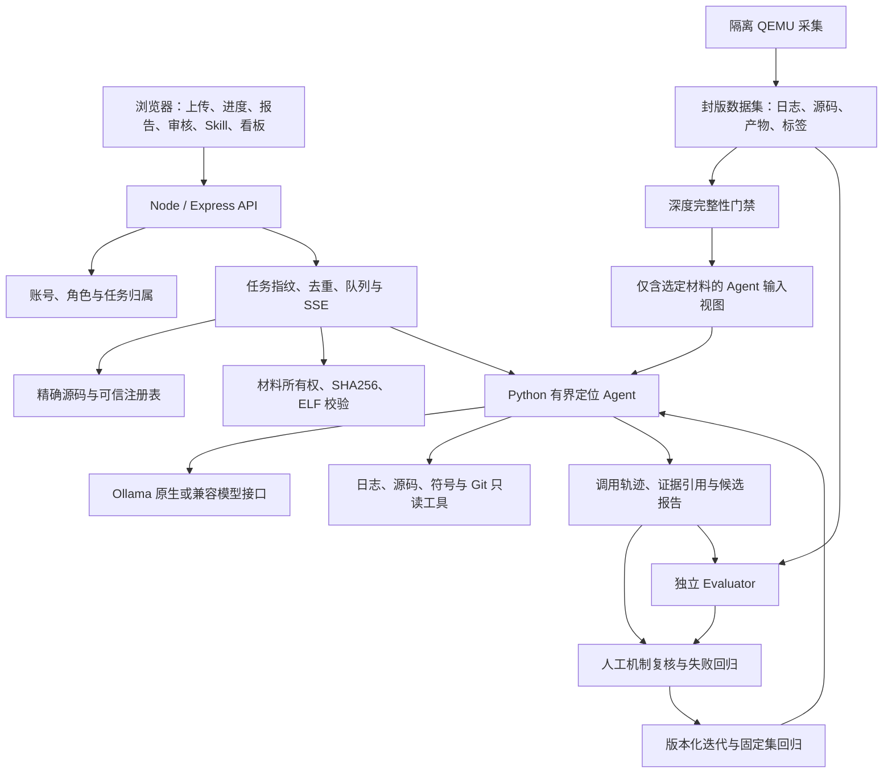

# Kernel Insight 完整系统方案

版本：2026-10-07。本文描述当前实现、数据资产、部署方式及后续闭环；历史记录与本文冲突时，以最新验收记录及代码为准。当前系统能够给出有证据的定界与定位候选，尚未完成自动根因证明和自动修复验证。

论文结构的配套讲解：[48 页网页版 Slide](../deliverables/kernel-insight-system/deck.html)、[逐页讲稿](../deliverables/kernel-insight-system/讲稿.md)、[数据与参考来源](../deliverables/kernel-insight-system/资料来源.md)。内容覆盖问题背景、理论依据、数据合同、系统架构、Windows 本地真实功能界面、配对试验和可播放流程；没有为制稿新增或改写模型成绩。实验组在正文分别称为“模型按需检索”和“自动预检增强”，原始记录标识保留于证据文件。

## 1. 目标与使用场景

输入是故障日志、对应源码与编译产物，允许缺少其中一项或两项。系统先说明故障出现的阶段、检测组件和第一现场，再调用工具寻找引发故障的代码位置或提交候选，保存每一步证据、模型请求数和用时。材料不足时输出缺口，不能用分类或猜测补齐定位结果。

测试人员提交日志并跟踪进度；专家审核诊断、编写诊断经验；管理员审核经验、维护身份及合入；领导查看经过人工确认的解决数和配对耗时改善。网站试跑、离线定位评测与真实业务统计分别计量。

当前范围：Linux/OpenHarmony 内核日志分诊、精确源码获取、ELF 材料核验、有界工具循环、代码候选、人工审核、声明式 Skill 及独立评测。自动执行漏洞 PoC、任意 shell、自动写入被分析源码、自动 bisect 和自动修复上线不属于现有能力。

## 2. 系统结构与责任边界



| 层 | 主要实现 | 职责 |
| --- | --- | --- |
| 浏览器 | `public/kernel-app.js`、`workspace-ui.js`、`agent-report-ui.js` | 上传、路由、任务进度、兼容新旧报告，转义模型文本 |
| 网站 API | `server/index.js` | 任务编排、数据持久化、试跑、报告和指标 |
| 身份 | `server/accounts.js` | scrypt 密码哈希、会话、角色、任务归属与最后管理员保护 |
| Skill | `server/skill-workflow.js`、`catalog.js`、`experience.js` | 声明式规则、经验正文、冻结测试、审核和合入 |
| 源码 | `server/kernels.js`、`agent-source.js`、`source-transport.js` | 版本身份、下载与缓存、局部源码准备、注册表校验 |
| 材料与分诊 | `server/materials.js`、`scripts/kernel_artifacts.py`、`kernel_triage.py` | ELF/配置/转储门禁、首诊断与日志证据 |
| 模型编排 | `server/agent.js`、`scripts/agent-runner.py` | 并发、子进程、预算、进度事件和报告归一化 |
| 定位循环 | `scripts/localization_agent.py` | 预检、工具选择、结构化输出及证据约束 |
| 数据工厂 | `tools/kernel-lab/` | 编译、隔离注入、运行记录、标签及版本封存 |
| 独立评测 | `run-localization-benchmark.py`、`review-localization.py` | 输入隔离、代码命中、请求/时间统计和机制复核 |
| 运维 | `manage-supervisor.py`、`run-website-selfcheck.py` | 守护恢复及自动化验收 |

## 3. 网站业务与数据模型

### 3.1 业务链路

登录后按身份进入相应页面，刷新保留深链接。上传日志可选择 Skill 组合、源码条件及诊断材料。后端返回任务编号及复用状态，浏览器通过进度快照或 SSE 查看真实阶段，完成后展示第一现场、代码候选、证据、缺口和 Markdown 报告。

人工审核必须填写结论；确认后计入解决数，退回则进入专家处理状态。满意度及人工基线可选，没有数据时显示空值。平均业务耗时包含提交至人工确认的等待时间，与 Agent 离线定位耗时不是同一指标。

### 3.2 持久化

当前是单进程、文件型存储，而非分布式数据库：

| 对象 | 保存位置 | 关键内容 |
| --- | --- | --- |
| 用户与会话 | `data/accounts.json` | 用户 ID、角色、密码哈希、会话令牌哈希 |
| 任务、Skill、历史 | `data/state.json` | 归属、状态、分析结果、审核、指纹及跑分记录 |
| 原始业务材料 | `data/uploads/`、`data/materials/` | 上传日志、ELF/配置及材料 SHA256 |
| 报告 | `data/reports/` | 原始日志副本与报告数据 |
| Agent 工作区 | `data/agent-runs/<job-id>/` | 输入、请求、源码、工具证据、模型输出及轨迹 |
| Skill 冻结快照 | `data/skill-pulls/` | 投稿测试时的案例、标签及指纹 |
| 源码与图表 | `data/kernels/`、`data/diagram-cache/` | 可复用下载、解压状态和图表缓存 |

账号文件通过临时文件和 rename 替换；业务状态仍由网站进程内统一管理。进程内队列和全文件写入不支持多副本并发写，当前不应横向启动多个网站实例共享同一数据目录。未来规模化需要数据库事务、独立任务队列及对象存储。

### 3.3 去重与可追溯

相同账号、规范化日志、Skill 内容/版本/顺序、源码条件、材料、Benchmark 与引擎身份形成条件指纹。相同进行中请求共享任务，已完成任务可复用；失败结果不复用。改变代码、注册表、材料或 Skill 条件应产生新任务；显式重新分析只针对已结束任务。

近似问题签名只提示关联，不直接免分析。每份报告应能追溯输入哈希、使用的源码与产物、Agent 代码版本、模型配置、工具调用和人工复核记录。

## 4. API 边界

除健康检查和身份入口外，业务 API 需登录。任务/报告只能由所有者或管理员访问；材料及投稿有独立归属校验。

| API | 用途 |
| --- | --- |
| `GET /api/health` | 引擎、模型、传输方式与实际模型连通性 |
| `POST /api/auth/login`、`register`、`logout` | 会话生命周期；注册固定为 tester |
| `GET /api/auth/me`、`POST /api/auth/profile` | 当前用户和个人资料 |
| `GET /api/admin/users`、`POST /api/admin/users/:id/role` | 管理员身份维护 |
| `POST /api/analyze` | 批量日志分析，接受材料与源码条件 |
| `GET /api/jobs`、`GET /api/me` | 有权限的任务与个人空间 |
| `GET /api/jobs/:id/progress`、`events` | 进度快照与 SSE |
| `GET /api/jobs/:id/evidence`、`log` | 工具证据和输入日志 |
| `GET /api/reports/:id`、`POST /api/jobs/:id/review` | 报告与人工确认 |
| `GET /api/benchmark`、`GET /api/benchmark/:id/log` | 当前网站集合与原始日志字节 |
| `POST /api/benchmark/:id/analyze` | 试跑，不计入真实业务贡献 |
| `GET/POST /api/kernels`、`GET /api/kernels/:key/source` | 下载、校验、缓存及有界源码读取 |
| `POST /api/materials`、`GET /api/materials/:id` | ELF/配置上传与归属核验 |
| Skill 投稿、审核、评测、激活 API | 见 `server/skill-workflow.js`；审核、测试和合入由后端门禁控制 |

上传材料单文件最多 2 GiB、合计最多 4 GiB，并预留磁盘空间；类型、ELF 头与配置文本分别检查。页面刷新不会自行触发 Skill Benchmark。

## 5. 数据集与完整性合同

### 5.1 当前资产

| 版本 | 数量 | 定位 |
| --- | --- | --- |
| `linux-community-v1` | 6 例，3 train / 3 test | 真实社区 crash report 与修复摘要；没有逐例匹配的完整产物或本地复现 |
| `openharmony-lkdtm-lab-v1` | 旧采集 67 场景，64 例入选，43 train / 21 test | 历史网站回归集；63 故障＋1 健康，36 例分类为待专家分析 |
| `openharmony-lkdtm-lab-v2` | 80 例，59 train / 21 test | 当前网站集合；在旧 64 例上新增 16 例启动与配置故障，均为 train、待专家分析 |
| `stability-v1` | 68 场景，60 ready，8 excluded；51 train / 9 test | 新严格材料集，59 故障＋1 健康，423 文件深验通过 |

版本库存已跟随最新交接更新：网站现为 v2，v1 是永久保留的历史回归集。启动实验共 19 场景，选入 15 条有效日志，另有 `CONFIG_BLK_DEV_INITRD=n` 配置故障 1 条，合计新增 16 例；覆盖早期内存、console、rootfs、init 和启动挂起。没有 console 输出的日志截断是对应场景的观测结果，不应补造日志。配置变体有额外源码补丁和不同 bzImage，不能直接套用 stability-v1 的运行身份或因果代码标签。

新旧注入集共用 59 个有效场景，但均重新采集，原始日志字节不同；旧集另外 5 个场景在新集排除，新集新增 OOM。不能叠加为独立样本，也不能跨版本混合成绩。备份、标注历史、网站副本和评测工作目录不计为新的独立数据集。

新集内核身份为 OpenHarmony `5.10.210+`，commit `f88704ae607f90518f67aee33790ac06d6ada77d` 加本地源码补丁及外部注入程序；GNU Build ID 为 `4bae92d13e7edbe54f2de539b0aef72c89615511`。不能把它当作该 commit 的干净内核或官方 mainline。

### 5.2 目录与字段

```text
data/datasets/stability-v1/
  manifest.json                 # 构建身份、共享文件、场景、split、哈希
  shared/                       # vmlinux、bzImage、ko、config、System.map
                                # source.tar.gz、补丁、构建日志、工具版本
  cases/<case-id>/
    serial.log                  # 原始 console 字节
    agent.log                   # 去除注入答案提示，保留行号
    run.json                    # 隔离参数、退出码、耗时、运行 Build ID
    ground-truth.json           # 诊断证据、因果函数和代码范围
    causal-source.c             # 用于独立评分的原始因果源码
    case.json
  annotation-history/v1/        # 历史标注；当前标注为 v2
```

合同版本为 `kernel-stability-dataset/v1`。校验路径不得逃逸、文件大小与 SHA256、运行身份、QEMU 无网络/无宿主共享、诊断证据行、代码范围、机制组 split 隔离及必需故障族。8 个 excluded 场景仍保留材料，但不进入有效定位分母。

`evidence_verified` 表示注入、诊断和代码证据经过合同校验，不等于独立确认每种根因机制。当前缺少 vmcore、故障引入提交真值及修复重跑；这些指标保持未知，不能由已有标注名称推导成功。

### 5.3 采集与扩增

采集在 QEMU TCG 客体中运行，记录内核身份、串口日志、命令、停止原因及构建信息。客体禁网络、禁宿主目录共享，以固定内存/CPU 和超时限制注入；KVM 当前不可用。预期诊断缺失、触发失败、超时或只有次生异常均排除。

封版目录不覆盖；扩增写入新版本。未生成 manifest 的中断目录允许续跑，保留已完成 case。首错曾误匹配 `debug:` 中的 `bug:`，已修正正则、保留 v1 标注并生成 v2；历史失败和修正理由均作为回归证据保留。

### 5.4 输入隔离

日志、产物和源码共有 7 种非空组合。原始材料完整保留，缺失实验通过导出独立视图实现。Agent 不接收 manifest、ground truth、场景名、注入指令或因果源码切片标签；Evaluator 独立持有它们。源码中的函数名称仍可能提示人工注入机制，这是数据自身局限。

```powershell
python tools/kernel-lab/kernel-dataset.py validate data/datasets/stability-v1
python tools/kernel-lab/kernel-dataset.py export data/datasets/stability-v1 --case corrupt_uaf_kmalloc --profile log --destination data/agent-runs/new-input-view
```

case ID 需从清单选择实际值，导出目标必须不存在。无日志时，仅凭同一构建的源码和产物不能识别具体故障实例，应拒绝实例定位；无源码时只能给日志支持的函数候选。

## 6. 定位 Agent

### 6.1 两阶段输出

定界输出 `firstScene`：阶段、报错组件、受影响组件、最早诊断行、CPU/任务/访问现场及证据引用。区分检测器（如 KASAN）、可能的故障代码所有者及后续 panic，不将最后一个栈顶自动当根因。

定位输出 `localization`：机制假设、函数候选、实际读过的文件/行范围、提交候选、缺失材料和下一项可证伪检查。代码行必须位于工具返回的源码窗口；提交声明必须读过补丁，且仍为 `candidate_unverified`，直到复现或 bisect 提供因果证据。

报告保留限制、原始证据与 `rootCauseVerified=false`。模型“高置信度”不能更改该结论；无效报告、预算耗尽和接口失败显式失败，不回退伪造成功。

### 6.2 工具与循环

| 工具 | 输入与作用 | 约束 |
| --- | --- | --- |
| `incident` | 日志首诊断与尾部摘要 | 正常日志可明确无诊断 |
| `log_read` / `log_search` | 原始行号窗口或关键词检索 | 输出、参数和窗口有界 |
| `source_search` / `source_read` | 已准备源码中的文件、符号及行窗口 | 路径受工作区约束，记录实际读取范围 |
| `symbolize` | 匹配 ELF 的符号＋偏移解析 | 运行 Build ID 与产物匹配；模块需独立身份 |
| `git_history` / `git_show` | 可信本地历史与补丁 | 单独确认的仓库；不执行模型生成命令 |

循环顺序：材料识别 → 可选 `eagerBoundary` 首诊断预检 → 可选 `sourceTriage` 从日志任务名/栈帧引导源码预检 → 模型选择工具 → 记录结果 → 结构化报告 → 校验引用和代码范围 → 保存轨迹。

源码预检不读取标签或案例 ID。自动工具与模型工具分别计数。仅有预检结果不能宣称模型已经完成组件推理；`firstSceneSeconds` 是诊断提取时间。

默认离线预算为 8 次实际模型请求和 240 秒，可配置。最后一次请求禁用工具以促使报告收敛；所有失败和格式修复也占请求预算。子进程有额外超时保护，当前线上并发为 1，防止单机模型被大量并发压垮。

### 6.3 源码与产物可信度

日志 commit 优先于版本；只能下载精确且可确认的仓库 revision。官方 release 校验官方 SHA256；commit 快照记录下载身份与本地哈希。未知厂商 revision 不静默映射至 torvalds 仓库。

本地可信注册表先验证输入日志 SHA256，再验证冻结源码文件 SHA256，准备匹配文件；未命中则保留缺口。源码缓存不是证明，历史 commit 也不能替代实际构建补丁。

符号与转储分析检查 Build ID、架构、版本及已知配置冲突；禁用 GDB 自动加载，仅运行固定只读查询。当前没有真实配套 vmcore，安装 crash/drgn 和模拟门禁通过都不能证明实际转储定位已完成。

## 7. Skill 与专家闭环

Skill 是声明式匹配、诊断经验及 Markdown 正文，不执行上传代码。投稿冻结 Benchmark 和标签，管理员审核后由提交者手动测试；管理员可记录原因跳过审核，但不能跳过测试。

同一时间最多运行一个 Skill 测试。候选需有正确命中、无误匹配、原本正确的案例不退化且整体类别得分不下降；基准 Skill 集合变更使旧测试失效。合入后保留作者与版本归因。

此处评测是类别检索精确率/召回率/F1，与 Agent 的代码定位评测分开。专家排行使用已确认解决能力、真实使用次数及 Skill 测试分数；试跑不计业务贡献，无评价/贡献数据不填造收益。

## 8. 评测口径与迭代流程

| 指标 | 口径 |
| --- | --- |
| 报告完成率 | 有效报告数 / 全部计划实例；失败保留 |
| 代码定位准确率 | 文件、函数及代码区间满足评分规则的故障样本 / 应评故障样本 |
| 函数命中 | 独立于代码行命中记录 |
| 机制准确率 | 独立审核，缺审核为 null |
| 引入提交准确率 | 有独立提交真值及因果验证才评分，目前 null |
| 模型调用次数 | 每一次实际 HTTP 尝试，含失败和格式修复 |
| 工具次数 | 自动预检与模型选择分开记录 |
| 定位耗时 | 模型工具流程起点至结果落盘前；不含注入、材料准备及网站排队，含模型接口等待 |
| 首诊断耗时 | 确定性工具发现首诊断的时间；无诊断为 null |

健康样本单独评误报/拒答；无日志组合单独评材料缺口和拒答。不能把这两类混入故障代码准确率分母。不同数据指纹、输入组合、代码版本、预算或模型条件分别报告，不从重试中挑最好成绩合并。

当前配对试验：同 6 例日志＋源码，故障代码命中由 3/5 到 5/5，模型请求 21 到 6，总分析时间 181.347 到 95.834 秒；额外 3 例只命中 2/3，RCU stall 仍是回归项。该小样本成绩不代表全部 60 例或生产准确率，OOM 的目标/实际分配量措辞仍需机制审核。

完整闭环步骤：固定数据/代码/模型身份 → 完整性门禁 → 隔离输入 → 全部样本执行 → 原始轨迹封存 → 独立位置评分 → 专家机制审核 → 失败回归队列 → 新代码版本 → 同条件配对重跑。`review-localization.py` 要求数据指纹、复核人、依据和证据引用，输出新文件，不覆盖原模型记录。

## 9. 部署与恢复

当前服务器为单机 Linux，项目目录 `/opt/kernel-insight`，实验目录 `/root/gpufree-data/kernel-insight-lab`。当前网站 release 为 `f4648fac616c`，其 Benchmark 文件已扩增为 v2（80 例）；最新交接说明网站按用户要求关闭，数据备份不启动服务。源码发布采用版本目录加 `app` 符号链接，持久数据独立于 release。

| 端口/进程 | 用途 | 管理边界 |
| --- | --- | --- |
| 8787 | 网站，仅监听 loopback | 项目 Supervisor |
| 11435 | 历史 Ollama 兼容代理 | 项目 Supervisor，当前原生引擎不依赖它取模型 |
| 11434 | 平台 Ollama | 既有平台服务，不由项目恢复器接管 |
| 30000 | 平台 SGLang | 历史分诊路径保留，新 closed-loop 跳过额外分诊模型 |
| 本机 8788 | SSH 转发至服务器 8787 | 临时访问通道，不是服务器公开端口 |

关键配置：

```text
KERNEL_INSIGHT_DATA_DIR=/opt/kernel-insight/data
KERNEL_AGENT_MODE=dsh
KERNEL_AGENT_ENGINE=closed-loop
KERNEL_AGENT_TRANSPORT=ollama-native
KERNEL_AGENT_BASE_URL=http://127.0.0.1:11434
KERNEL_AGENT_MODEL=qwen3.8:27b-kernel-8k
KERNEL_AGENT_CONCURRENCY=1
KERNEL_AGENT_PYTHON=/opt/kernel-insight/runtime/venv/bin/python
KERNEL_VERIFIED_SOURCE_REGISTRY=/opt/kernel-insight/verified-source-registry.json
KERNEL_BENCHMARK_DIR=<可选：独立网站 Benchmark 路径>
```

`KERNEL_AGENT_MODE=dsh` 是历史启用开关名称，配合 `ENGINE=closed-loop` 实际选择新有界循环；不设置时本地默认是确定性分诊。Windows 可运行网站、校验和协议测试；Linux bubblewrap、QEMU、crash 等运行环境需要 Linux，不能直接执行备份中的 Linux venv。

恢复顺序：验证归档哈希 → 在独立 Linux 目录检查和恢复数据/当前 release → 重新确认运行时及外部模型依赖 → 设置权限、脚本 LF/执行位与配置路径 → 运行受控 Supervisor 恢复器 → 健康检查 → 隔离业务验收 → 线上试跑 → 对照证据与原始日志。不要先覆盖本地 `data/state.json` 或把服务归档直接解压到项目根目录。

`deploy-server.sh` 保存历史首次部署方式，不能将其历史 dsh 默认配置直接当作本轮 closed-loop 的最终配置；以快照配置、本节及最新自检文档为准。外部模型权重不属于项目恢复归档，需在目标机器单独提供相同模型。

## 10. 本地项目与数据归档

```text
1_AI4-Loc/
  public/ server/ scripts/ tests/ tools/    # 可发布实现与测试
  docs/SYSTEM_DESIGN.md                    # 本方案
  docs/LOCAL_DATA_GUIDE.md                 # 本地数据入口、恢复与清理记录
  data/benchmark/                         # Git 内公开社区夹具，保持 6 例
  data/datasets/                          # 四个数据集版本，Git 忽略
  data/experiments/kernel-lab/             # 启动阶段、旧采集、评测与失败证据
  data/server-snapshots/<snapshot>/        # Linux 恢复归档、库存、校验结果
  data/source-repositories/               # 本地保留的内核 Git 历史
  data/dataset-audit/                      # 既有原始实验与失败证据
  data/toolchains/ data/kernels/           # 运行依赖与可复用源码
```

`sync-project-data.py` 使用已知 SSH 主机身份、内存密码、不可变快照 ID、最多 4 条连接的分段续传及 SHA256；服务端备份要求显式 `--include-private`。归档保留 Linux 符号链接、执行位和源码历史；Windows 展开可直接使用的数据与实验材料；冗余的 Linux `shared/source-tree` 留在恢复包，完整冻结源码另保留在 `shared/source.tar.gz`。实验构建符号链接只保存在原归档，避免系统属性损失。私有业务备份只在获得明确授权后执行，不进入 Git。

快照分三部分：`lab.tar.gz` 保存实验目录（含旧/新数据、源码、构建、启动阶段、注入、评测与失败证据）；`service.tar.gz` 保存网站持久数据、运行时及配置；`release.tar.gz` 保存当前发布代码。清单明确省略可再生缓存、旧 release 副本、部署传入包和外部模型权重。业务 state/accounts 捕获前后哈希不一致则拒绝完成，实时运行日志可有不同截点，不宣称跨文件事务快照。

## 11. 自检、故障处理和验收

```powershell
npm ci
npm test
python -X utf8 -m unittest discover -s tests -p '*_test.py'
python scripts/run-website-selfcheck.py --output data/ui-validation/new-run --skip-live
python tools/kernel-lab/kernel-dataset.py validate data/datasets/stability-v1
```

完整自检还可指定线上 base、真实 Benchmark case、已匹配源码的日志及下载版本，见 [WEBSITE_SELFCHECK.md](WEBSITE_SELFCHECK.md)。每次输出到新目录，返回非零即失败；只生成自检报告不算所有功能成功。

最新既有验收：36 个 Node 测试、29 个 Python 测试；隔离业务 15 项、线上 9 项、匹配源码真实模型 8 项通过。浏览器布局单独验证；没有重新执行模型试跑时不更新真实模型成绩。

| 故障 | 当前处理 |
| --- | --- |
| 磁盘不足 | 接收分析/材料前拒绝，已存报告仍可读 |
| 模型不可达或预算耗尽 | 保留失败、错误及请求数，不复用失败结果 |
| 源码/身份不匹配 | 不静默替换版本，报告缺口，禁止不可信符号化 |
| 不完整数据集 | 阻止导出及定位 Benchmark |
| 后台进程停服 | 检查真实监听、PID 和 Supervisor，不根据旧日志猜本次原因 |
| 上传越权/归属不匹配 | 后端拒绝；不能依靠前端隐藏按钮 |
| 自检产生任务 | 隔离测试用独立目录；线上使用试跑任务，不计领导指标 |

## 12. 已知限制与后续实施顺序

1. 先补独立根因机制审核，修正 OOM 表述和 RCU stall 定位；保留原失败结果。
2. 固定代码版本，在 60 个 ready 样本上完成全量评测，再分别扩展 7 种材料组合；不以当前小样本替代。
3. 增加健康、噪声日志、真实业务案例和多个内核版本，按机制与来源分组划分，避免泄漏。
4. 加入可匹配 vmcore 的受控采集，先验证身份和只读工具，再评转储定位。
5. 为真实缺陷建立引入提交、复现条件及补丁前后验证；具备这些证据后才能评提交定位或自动修复。
6. 需要多用户规模化时迁移事务数据库、持久任务队列和对象存储；补齐密钥管理、备份保留及恢复演练。

相关证据：[数据集审计](kernel-dataset-audit-20261007.json)、[配对迭代](agent-iteration-20261007.json)、[网站验收](website-acceptance-20261007.json)、[定位闭环](KERNEL_LOCALIZATION_LOOP.md)、[部署经验](REMOTE_AGENT_DEPLOYMENT.md)。

本轮归档与整理的附加验收：Node 36/36、Python 38/38（原 29 项＋备份安全 9 项）、隔离业务 15/15 通过；未重跑或改写前述模型成绩。
