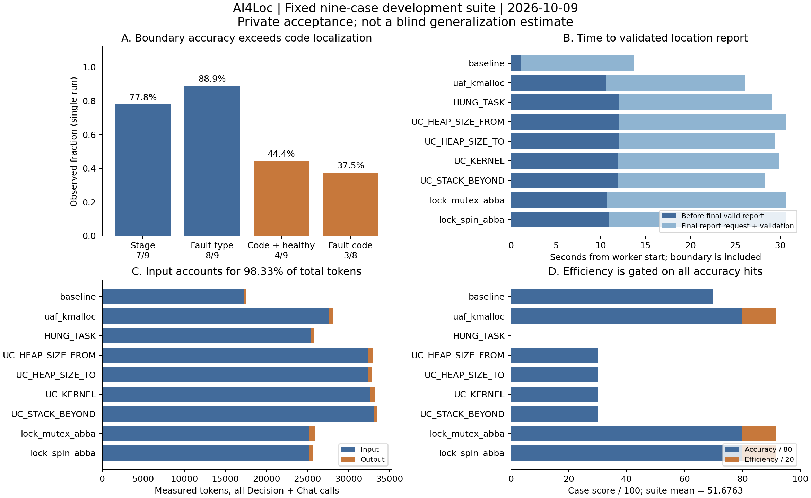

# AI4Loc 定位系统：网站闭环验收与评测分析

日期：2026-10-09。研究对象：固定九例开发套件上的一次真实模型、真实工具、独立沙箱的网站 API 验收。本文区分可重复的观测、分析推断和下一轮待验证方案。

## 1. 摘要与主要结论

个人 Agent/Skill 组合保存、分析任务选择、社区一键跑分、个人结果联动、隐私控制、取消及导出已接入同一评测链路。本轮私有验收九例全部完成，九例隔离审计及成本遥测均完整；所选 Prompt 在 25 条生成请求中实际出现。功能验收通过不等于定位能力提升。

阶段命中 **7/9（77.78%）**，故障类型命中 **8/9（88.89%）**，代码位置及健康拒答命中 **4/9（44.44%）**；仅故障代码定位为 **3/8（37.50%）**。总分 **51.6763/100**，其中准确分 47.7778/80、效率分 3.8986/20。累计定位报告就绪时间 248.653 秒，34 次模型 HTTP 请求，255636 Token。根因机制及引入提交没有独立真值，准确率均为 **null**。

主要能力缺口是从检测器追溯触发代码：四例 USERCOPY 都正确分类，却停在 `usercopy_abort` 等检测函数；HUNG_TASK 的阶段、类型与位置均未命中。已有数据不能证明本轮提分，也不足以估计真实生产故障泛化能力。



图 1：全部数值来自保留的真实验收摘要。时间图将最终有效报告请求与此前时间分开；定界已包含在总定位时间中。输入 Token 为所有请求的累计值，不能解释为独立日志长度。样本只有九例，未绘制会暗示独立抽样的误差条。

## 2. 任务定义、系统与验收范围

输入是日志、匹配源码、匹配编译产物；系统允许材料缺失，并应报告证据不足。本轮使用完整材料路径，因此**没有测量缺日志、缺源码、缺 ELF 时的准确率**。

定界输出发生阶段、首个诊断类型、报告组件与受影响组件；定位输出证据引用、候选代码位置、机制假设及验证状态。网站评分目前量化阶段、类型及代码位置；组件与“第一现场”的描述没有独立评分真值，不能由这三项分数推导其准确率。

执行链路为：用户选择组合 → 服务端冻结 Prompt/Skill 版本 → 冻结数据、代码、模型配置与预算 → 独立匿名 worker → Decision 有限分类 → Chat 按需读证据 → 校验结构与源码引用 → worker 退出 → 父评测器读取标签评分 → 保存个人结果 → 按公开选择更新同 cohort 前十用户榜。

| 功能 | 交付行为 | 验证证据及范围 |
| --- | --- | --- |
| 个人组合 | 选择 Agent/Skill、生成预览、保存/修改/删除、设置常用 | API 回归与本地页面检查；快照不可改写历史任务 |
| 新建分析 | 选择常用组合，Prompt 实际进入模型消息并参与去重 | 代码回归；本轮验收 25 条生成消息含选择的 Prompt |
| 一键跑分 | 服务端固定全套样本，限制并发、预算与模型接口 | 独立私有实例通过真实网站 API 完成 9/9 |
| 结果联动 | 个人结果、进度、逐例成本、取消及 JSON 导出 | Node 服务与界面回归；不覆盖旧 Skill PR 跑分 |
| 前十用户 | 每用户同 cohort 最佳公开有效记录，准确分优先 | 排序与隐私测试；私有验收成绩排除出榜 |
| 沙箱 | UUID 工作区、固定 `/work`、只读证据、标签外置 | 9/9 canary 审计；不代表可执行任意用户代码的安全认证 |
| 跨平台 | Windows 原生 Demo；Linux/WSL2 完整工具与沙箱 | 入口及依赖检查回归；没有新增另一台裸机全量部署验收 |

生产部署 release 为 `163bdd0af0ec`，于北京时间 2026-10-09 00:57:16 激活。网站健康，原 SGLang/Ollama 未重启。完整模型验收在专用私有实例执行，没有向生产账号、生产跑分历史或公共榜单植入测试记录。当前公共榜单没有有效用户成绩时应为空。

## 3. 数据、标注与实验条件

### 3.1 样本与完整性

严格数据集 `stability-v1` 含 68 场景，其中 60 ready（59 故障、1 健康），其余 excluded；完整合同校验覆盖 423 文件。固定 ready test 仅九例：UAF 一例、HUNG_TASK 一例、USERCOPY 四例、锁依赖两例、健康一例。其他社区浏览集与启动阶段集不参与本次评分，不合并分母。

数据 manifest SHA256：`10194de902204fd6621428e2631f044fc17dada0b4fcea679ba1e00d285bb63f`。新阶段/类型标注由原始 collector 诊断、注入记录及工作负载开始标记交叉核对，质量级别 `collector_verified`；不是独立专家双人审定。健康记录的标签为 unknown/none，表示未发现显式诊断，而非证明整个内核无缺陷。

### 3.2 模型、预算与版本

- Chat 走 Ollama 原生接口，验收模型名 `qwen3.8:27b-kernel-8k`；Decision 走 SGLang typed-decision 接口。这里测的是当前服务配置，不等价于已部署专门训练的 Jev 权重。
- 硬件记录为 A100 80GB、驱动 580.126.09；模型及启动配置标识纳入 cohort。模型别名不是不可变权重证明；SGLang 权重仍需管理员持续维护精确检查点身份。
- 单例上限 8 次模型 HTTP 请求、240 秒；固定只读工具。模型槽与普通分析共享串行并发控制。
- 运行 ID：`add670f7-1695-4564-8337-7109e5cae0d2`。
- cohort：`fef95964ae3afd2814f56fb21c647ec6270acf21a9d0f363397af42e0998823d`。
- 完成于 UTC 2026-10-08 17:03:58.690，即北京时间 2026-10-09 01:03:58.690；私有提交 `publish=false`。

### 3.3 泄露防护及适用边界

worker 不挂载标签、manifest、父评测目录、私有业务状态或宿主 `/proc`；标签在 worker 完成后由可信父评测器加载。每例匿名目录只能去除宿主路径身份，不能消除日志与源码内的函数名。网络保留以访问管理员固定模型服务；受限工具不提供任意 shell/URL，但这不等价于网络 namespace 防火墙或 cgroup 资源隔离。

test 已用于历史调试，注入函数名也可能成为捷径。因此本次属于**公开开发练习评测**，不满足隐藏盲测条件。运行期标签不可见不能证明训练数据无污染，或用户 Prompt 未携带公开答案。泄露审计详见 [标签审计](BENCHMARK_LABEL_LEAKAGE_AUDIT.md)。

## 4. 定量协议与统计口径

每例准确分 `A = 10×阶段命中 + 20×类型命中 + 50×代码命中`。代码命中要求路径与符号精确一致、行区间与真值重叠，并通过真实源码读取引用校验；最多两个位置，每个最多 40 行。健康例的代码项是“无位置、无候选符号、无故障假设”的拒答判定，**不是找到一个真实故障位置**。

只有三项全对且成本遥测完整的样本获得效率分。五项分别使用 `w×r/(r+x)`：定界 `(w=4,r=5秒)`、定位 `(6,60秒)`、报告 `(2,20秒)`、Token `(4,12000)`、HTTP `(4,4次)`。固定整套平均得分，失败/超时保留在分母；缺标签、遥测或隔离证据则不能入榜。榜单先比较准确分，再比较总分，同 cohort 每用户只选最佳公开有效成绩。

这一准确性门控设计防止快速答错得分，但权重与参考量仍是工程政策，尚无用户研究证明它们是最优效用函数。报告时间是定位时间的子集，评分给予其额外偏好，意味着有意重复关注交付延迟；不能将两者相加宣称总运行时间。

统计分位数采用 nearest-rank `sorted[ceil(p×n)-1]`；n=9 时 P95 就是最大值，不能称为稳定服务尾延迟。当前为单次顺序运行，没有独立重复、随机划分或负载控制，不提供显著性、因果提升或生产 SLA 结论。

## 5. 结果与逐例误差

| 样本 | 阶段 | 类型 | 代码/拒答 | 定位秒 | Token | HTTP |
| --- | ---: | ---: | ---: | ---: | ---: | ---: |
| baseline | 0 | 1 | 1 | 13.666 | 17561 | 2 |
| corrupt_uaf_kmalloc | 1 | 1 | 1 | 26.160 | 28097 | 4 |
| lkdtm_HUNG_TASK | 0 | 0 | 0 | 29.146 | 25835 | 4 |
| lkdtm_USERCOPY_HEAP_SIZE_FROM | 1 | 1 | 0 | 30.639 | 32950 | 4 |
| lkdtm_USERCOPY_HEAP_SIZE_TO | 1 | 1 | 0 | 29.418 | 32833 | 4 |
| lkdtm_USERCOPY_KERNEL | 1 | 1 | 0 | 29.920 | 33197 | 4 |
| lkdtm_USERCOPY_STACK_BEYOND | 1 | 1 | 0 | 28.343 | 33537 | 4 |
| lock_mutex_abba | 1 | 1 | 1 | 30.711 | 25904 | 4 |
| lock_spin_abba | 1 | 1 | 1 | 30.650 | 25722 | 4 |

0/1 表示评分未命中/命中。全部完成且无套件失败，但“completed”仅指生成有效结构化结果，不表示定位正确。

### 5.1 检测点与触发点混淆

四例 USERCOPY 全部输出 `mm/usercopy.c:usercopy_abort:83–100`；KERNEL 还包含 `check_kernel_text_object:117–145`。这些位置能解释检测逻辑，却未命中注入触发位置。模型已识别运行期和 usercopy 类型，说明主要缺口发生在**因果追溯与证据覆盖**，不是再做一层类型分类就能解决。

四例占故障样本 50%，其全部未命中显著拉低微平均。它们来自同一检测机制，不能当成四种独立泛化成功/失败。按当前四个故障机制族计算代码命中宏平均为 `(1/1 + 0/1 + 0/4 + 2/2)/4 = 50%`，仅用于展示类别不均衡，不能代替官方 3/8 分数。

### 5.2 HUNG_TASK：错误拒答与证据窗口

该例输出 boot/none，无候选代码，三项全错。保留报告称只看到早期启动片段，并提及 incident 工具失败。由此可提出“工具失败后的日志窗口覆盖不足”的调查假设；**仅凭最终文本不能证明具体根因**，下一步必须复核工具轨迹、失败原因、窗口裁剪及完整日志覆盖。拒答有助避免编造位置，但在实际有诊断的样本上仍是漏诊。

### 5.3 健康例：拒答与阶段定义不一致

baseline 无故障类型、无候选位置与假设，拒答正确；但输出 stage=boot，而规则要求 unknown，因此阶段项失分。阶段应描述“问题发生阶段”，不能直接将正常启动日志的阶段视为故障阶段。只有一个健康例，不能据此宣称误报率受控。

### 5.4 命中例及证据强度

UAF 输出 `external/ki_bench.c:ki_uaf_kmalloc:106–114`；两例锁依赖输出 `ki_thr_mutex_abba:126–134`、`ki_thr_spin_abba:143–151`。它们有源码证据支持，但属于人工注入路径，且均未验证引入提交、修复后重放或完整机制。因此保留 `rootCauseVerified=false`，不可把三个代码命中写成三个已证实根因。

## 6. 时间、调用与 Token 分析

| 指标 | 合计 | 均值 | 中位数 | P95（本样本最大值） |
| --- | ---: | ---: | ---: | ---: |
| 语义定界秒 | 9.6335 | 1.0704 | 1.1161 | 1.2453 |
| 定位报告就绪秒 | 248.6530 | 27.6281 | 29.4180 | 30.7110 |
| 最终报告输出秒 | 155.2847 | 17.2539 | 17.3854 | 19.9927 |
| Token | 255636 | 28404 | 28097 | 33537 |
| 模型 HTTP | 34 | 3.7778 | 4 | 4 |

套件 wall=250.9086 秒，排队=0.002 秒；wall 比逐例定位累计多 2.2556 秒，覆盖准备/校验等套件开销。报告输出占累计定位时间 **62.45%**，其余 93.3683 秒；定界又包含在定位累计内，不能将上述三类时间相加。

34 次 HTTP 由 **25 次生成请求 + 9 次 Decision 请求**组成。每次 Decision 有三个问题，合计 27 个类型化问题，仍只算九次 HTTP。108 次工具调用中 100 次为自动预检、8 次为模型选择；其中 49 次实际读源码。不能把 108 次工具调用写成模型自主调查 108 次。

输入 251359 Token、输出 4277 Token，输入占 **98.33%**。保留请求 usage 显示生成接口输入 150382、输出 4277，余下 100977 输入来自 Decision；这个差额是 token 使用量归属，不是独立文本长度。当前不同模型 tokenizer 计量单位未归一，合计可作为固定 cohort 的工程成本代理，不能直接转成跨服务计算量或货币费用。重复上下文与较长输入值得优化，但没有上下文裁剪消融，不能断言删减输入不会损害准确率。

只有 UAF 与两例锁依赖三项全对，得到效率分；baseline 虽拒答正确，因阶段错误效率为零。套件效率分五项贡献分别为：定界 **1.1224**、定位 **1.3465**、报告 **0.3480**、Token **0.4151**、HTTP **0.6667**，合计 **3.8986**。改善未命中机制的代码定位比只压缩当前失败例的延迟更能提升有效得分。

## 7. 历史对照：Decision 快不等于系统快

| 实验 | 控制 | 试验 | 可支持的结论 |
| --- | --- | --- | --- |
| 历史有限类型分类，同一服务配置，9例×3重复/方法 | Chat 均值2.0241秒，27/27；P95 2.3113秒 | Decision 均值1.2304秒，27/27；P95 3.0795秒 | 平均耗时降低39.21%，P95更高；只验证 family 分类 |
| 历史端到端九例 | 25 HTTP，252.946秒，故障代码4/8 | 混合34 HTTP，275.619秒，故障代码4/8 | 请求增36%，累计时间增8.96%；未观察到端到端提速 |
| 本轮网站验收 | 非同条件历史基线 | 34 HTTP，248.653秒，故障代码3/8 | 平台计量与闭环可工作；不能作为提分或加速证据 |

前两行来自 [历史混合实验](decision-chat-hybrid-results-20261009.json)。有限分类的重复是同九例重复测量，非 27 个独立故障。其准确率指标是 family，而本轮 panicType 与 stage 使用新增边界标注，不能直接把两者比较。完整系统还包含不同后端、上下文、工具及报告开销，有限分类结果不能外推为完整定位加速。

本轮 Prompt、报告协议与评分校验变化，故障代码 4/8→3/8 应记录为观察到的差异，**不能据此声称稳定退化或改善**。下一轮需要同输入、同 Prompt 约束、同预算、相同评分的配对重复与机制级留出。

## 8. 改进优先级与可证伪的下一轮实验

1. **补齐触发代码证据**：在开发集针对 usercopy 从检测器沿调用栈上溯，读取调用者和大小/指针来源，区分报告组件与责任组件。记录“读取触发函数覆盖率”和定位命中，防止只靠 case 名或固定函数词典猜答案。
2. **工具失败可恢复**：HUNG_TASK 先核查 incident 失败与日志窗口，再实现头/首诊断/尾部的覆盖检查、显式错误反馈与受预算约束的重读。用原失败轨迹回放验证恢复，不在最终 Prompt 写答案。
3. **校准无诊断输出**：确定性校验无显式故障时 stage=unknown，并允许材料不足拒答；在新增健康/截断负例上同时评估漏诊、误报和拒答率，避免只适配一个 baseline。
4. **控制上下文成本**：比较原输入、首诊断邻域+调用链、带缺口标识的分段检索，测量输入 Token、位置命中、尾延迟和失败修复次数。要求准确性约束成立后才接受节省。
5. **进行配对消融**：纯 Chat、Decision→Chat、规则→Chat，冻结 Prompt/Skill/版本与预算。按机制族划分开发和新隐藏集，交错执行顺序、多随机重复；报告逐例配对差值，独立机制才是泛化统计单位。
6. **闭合因果验证**：补充人工双人机制标注、已知引入提交与修复提交、匹配构建及重放结果。在没有这些证据前继续保持机制/提交准确率 null；修复后不再触发仅是必要验证之一，不自动证明唯一根因。

正式评估应单列完整材料、缺日志、缺源码、缺产物四类，新增启动/关机、OOM/RCU/watchdog 等独立机制及真实社区案例。当前八故障一健康、以运行期注入为主的结果不覆盖这些能力。

## 9. 证据、复现与发布边界

公开文件：

- [冻结验收摘要](agent-benchmark-platform-results-20261009.json)：逐例命中与实测遥测，无私人 Prompt 或原始业务日志。
- [逐例 CSV](results/agent-benchmark-20261009/cases.csv)、[统计 JSON](results/agent-benchmark-20261009/statistics.json)、[矢量图](results/agent-benchmark-20261009/benchmark-analysis.svg)：由同一公开摘要生成；统计 JSON 保留源摘要 SHA256（UTF-8 字节，CRLF 统一为 LF，兼容跨平台 Git 检出）。
- [平台设计与部署](AGENT_BENCHMARK_PLATFORM.md)、[跨平台部署](CROSS_PLATFORM_DEPLOYMENT.md)、[SGLang/Jev-like 部署](SGLANG_JEV_LIKE_DEPLOYMENT.md)、[混合 Agent 设计](DECISION_CHAT_HYBRID_AGENT.md)。

重算表格与聚合断言，仅需 Python 标准库；加 `--figures` 需要 matplotlib。此命令不访问私有证据或模型服务，不是重新跑模型：

```bash
python scripts/summarize-agent-benchmark.py
python scripts/summarize-agent-benchmark.py --figures
```

完整模型运行需要按平台文档恢复受控数据集与匹配源码/编译产物，配置 Linux/WSL2、bubblewrap、模型服务和精确硬件/模型身份。数据与旧补充包不随本次 GitHub 提交公开；补充包绑定旧 Git 基线，合并恢复步骤见本地数据指南，不能无检查覆盖最新仓库。

原始证据保存在 Git 忽略目录 `data/local-archive/agent-benchmark-20261009/`；归档 `retained-evidence.tgz` 为 653550 字节，SHA256 `0eaea754e219652e25a85b589f6e90f44dd5f8aa63436bee6601833cd071c700`。模型请求、工具轨迹、私有 Prompt 与完整业务状态不上传。归档中的早期测试计数为当时快照，最终本地回归为 Node 42/42、Python 53/53；完整原始证据不被后续汇总改写。

本次 GitHub 发布包含平台功能、Decision/沙箱与跨平台依赖代码、回归测试、部署指南和脱敏结果。不涉及额外演示稿改动，也不向生产社区公开验收账号和成绩。
