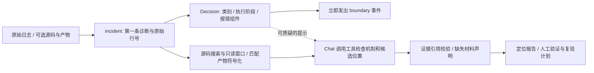

# Decision 快速定界 + Chat 根因分析：设计与实验

记录日期：2026-10-09。目标是缩短用户获得有用定界的等待时间，同时保留源码/产物工具和 Chat 的深入分析能力；不把类型化概率误当作根因证明。

## 分工与数据流

定界仅回答有限问题：第一条诊断属于哪类、发生在哪个阶段、哪个组件报错。报错组件是 detector，未必是故障 owner。Decision 批量提出三个独立 choice 问题，原始证据相同；它不生成复杂分析文本，不选引入提交，也不直接触发修复。

Chat 保留完整的受限工具：实际源码搜索/读取、日志窗口、Build ID 匹配后的符号化及经信任验证的 Git 历史。它可以质疑定界，不因分类选择而丢弃其他源码路径。完整报告仍须通过来源与引用校验；缺少日志/源码/产物时明确降级，独立因果检查缺失时 rootCauseVerified=false。

## 实现

- scripts/boundary_router.py 定义固定问题与双接口比较方法；boundary 状态仅包含可用性和有原始行号的诊断窗口。
- scripts/localization_agent.py 先发送可观察的快速分类事件，再执行源码证据和 Chat 调查；Decision 失败时计数并回退到 Chat。分类与生成共用总 HTTP 预算。
- 正常源码调查最多先进行两轮模型探索，然后在已读到源码时要求第三轮交付有边界的结论；完全无明确诊断或缺少源码时尽早交付缺失证据声明。预算仍是 8 次，失败、格式修复均计数，不假装所有案例固定三次。
- 原生 dsh 插件支持可信配置 mode=boundary，注册 kernel_boundary；保留 kernel_decide 排序工具的兼容入口。闭环引擎复用相同 Python 逻辑。
- 网站用 KERNEL_BOUNDARY_ROUTER=decision 启用。Decision 端点/协议/模型和 Chat 端点独立配置，缓存身份包含这些配置及代码。

早期不限探索深度的版本出现重复低价值调用、上下文压力和模型 HTTP 500，已停止该实验并保留部分结果。最终版对两种对照使用同样的证据选择和探索上限，避免把额外源码预取误算成 Decision 的收益。

## 定界速度与准确性：同一检查点对照

使用现有 ready test 的全部 9 个案例（含一个无故障日志），每种接口每例重复 3 次，共 54 次。固定 seed=20261008 随机交错顺序，先用合成日志预热并排除预热。Decision 与 Chat 均使用同一 SGLang、同一 Qwen3.8-27B 检查点、相同诊断证据及问题定义；Chat 关闭 thinking，并用 JSON schema 限制相同三个字段。没有另换小模型制造速度差。

|指标|Decision|Chat|
|---|---:|---:|
|故障类别正确次数|27/27|27/27|
|接口错误|0|0|
|平均秒|1.2304|2.0241|
|中位数秒|1.0623|2.1081|
|P95 秒（最近秩）|3.0795|2.3113|

这里的准确性只评估 evaluator 既有 family taxonomy，不包括没有独立人工真值的 stage/reporter，更不是代码定位或根因准确率。9 个唯一案例重复三次不能当成 27 个独立问题。单卡、低并发、顺序随机化的结果不能承诺其他模型、并发或长日志的 SLA。

平均耗时降低约 39.2%，中位数降低约 49.6%；P95 反而变差约 33.2%。Decision 的优势是省去输出解码及 JSON 生成/解析，代价是三个问题各有自己的预填充。输入长、问题多、GPU 排队或不同批次/缓存状态可能抵消优势。当前数据支持“通常更快得到类别”，不支持“任何情况下更快且永远不降准确率”。

初版同样 54 次请求在 USER​COPY 类别失败：incident 漏识别 usercopy 的原始报告，只给出后续 panic。现修正通用 usercopy/kernel BUG/invalid opcode 诊断规则并补充 taxonomy，未修改原数据或答案。首版输出、评分缺失 usercopy 映射的原报告和修正后测试均保留；这属于在已知 test 上迭代，不能称作盲测。

## 为什么根因仍由 Chat 处理

有限选择无法发现选项中不存在的机制、函数或提交。即使 top-1 很高，也可能只是从错误候选中挑出“最像”的答案。根因分析需要沿分配/释放、调用者/被调用者、等待者/完成者、锁依赖和修改历史追踪，且不同案例需要不同工具。让 Chat 负责开放调查更适合这种任务，但模型本身也不能代替修复重放或独立验证。

分层通常是先增加一次快请求，把分类提前返回；它不自动减少后续 Chat 的工作量。因此应同时报告 boundarySeconds、总定位时间、两类 HTTP 次数、代码定位命中、失败和拒答，而不是只截取 Decision 的单次耗时宣称整个系统提速。

## 复现与留存

部署配置见 [SGLang Jev-like 部署记录](SGLANG_JEV_LIKE_DEPLOYMENT.md)。隔离与污染风险见 [标签泄露审计](BENCHMARK_LABEL_LEAKAGE_AUDIT.md)。完整私有实验位于服务器 `/opt/kernel-insight/experiments/decision-hybrid-20261008/`，本地审计包位于 `data/local-archive/decision-hybrid-20261008/`。代码、提示和参数冻结后再做独立新增样本评测，才可外推泛化能力。

## 最终隔离代码定位对照

两组使用相同的 9 个 ready test、log+source、证据预取和探索预算；生成分析均由 Ollama 的 qwen3.8:27b-kernel-8k 承担。控制组没有额外分类请求，混合组增加 SGLang Decision 的三个问题。不同于前述同检查点有限分类对照，这里评估的是完整应用组合。

|指标|Chat 控制组|Decision + Chat|
|---|---:|---:|
|完成案例|9/9|9/9|
|代码位置命中（8 个故障）|4/8|4/8|
|实际 HTTP 请求|25|34|
|案例耗时之和（秒）|252.946|275.619|

混合组没有观察到代码定位准确率下降，也没有提升；9 个额外 Decision 请求令总时间增加约 9.0%。四个 usercopy 位置仍未命中，提示模型容易停留在检测器而没有追到触发代码。现阶段适合把快速定界作为提前返回的中间结果，不能宣传为整个根因流程提速。引入提交与因果验证准确率仍为 null。

18 个 worker 的 isolation-audit 均通过，评测器 canary、宿主数据、业务数据和 proc 根入口不可见。原生 dsh SDK 实际调用 kernel_boundary 成功；System One 的 choice/noul/score 适配通过现有服务测试，最初 noul 标量转换失败记录也保留。专用 PPLX 权重未部署或实测。

公开机器可读汇总见 decision-chat-hybrid-results-20261009.json。评测代码与上线代码的差异仅是补充请求 payload 审计，以及 System One noul 响应适配修正；本次对照使用 decisions 协议，不受后者影响。未在测试进行中更换最终对照的代码。
