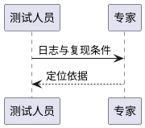

# 专家经验阅读与评价

专家中心的经验卡片进入 `#/skills/experience/<skill-id>`，展示投稿中保存的 Markdown 正文、贡献者、版本和真实业务成效。已有经验未提供独立正文时，显示原分析建议、匹配条件及对应类别的社区案例，案例保持来源、版本与人工摘要的验证边界。

投稿支持填写 Markdown、导入 `.md`、预览正文；管理员在审核页也可打开正文阅读。预览和关闭弹窗保留当前草稿，预览不会启动 Benchmark 或提交投稿。

支持表格、代码高亮、任务列表、脚注和自动链接。图表使用 fenced code blocks：

````markdown



````

Mermaid 依赖从本站加载，使用 strict 模式。PlantUML 在本机 Java 进程中渲染，使用 [官方 SANDBOX 配置](https://plantuml.com/security)，禁止外部资源和文件引用，限制源码长度、内存、执行时间和同时渲染数量，并按内容缓存 PNG。Markdown 禁止原始 HTML，并通过白名单过滤输出。

Windows 初次部署：

```powershell
npm install
npm run setup:diagrams
npm start
```

安装脚本从 Azul 官方 CDN 和 Maven Central 下载固定版本 Java JRE 与 PlantUML MIT 发行包，并校验固定 SHA256。运行环境放在 `data/diagram-runtime`，不纳入版本控制。其他系统可以通过 `PLANTUML_JAVA` 和 `PLANTUML_JAR` 指定已有运行环境。

任务分析报告中的验证表单可提交 1–5 星满意度；不填则不参与满意度计算。卡片展示调用次数、去重的已解决问题数、满意度及评价样本数。满意度为 4–5 星占比，同一问题按签名取最新评价；Benchmark 试跑不计入业务评价，无评价显示“—”。详情同时展示平均星级，并在折叠的统计口径中解释这些数值。

登录页已去除默认账号提示及营销说明；侧栏、页面头部和页脚减少重复说明，排名规则和提交规则改为按需展开。

验证：22 项自动测试覆盖原流程、Markdown 保存与过滤、插件输出、评分去重和本地 PlantUML 生成；浏览器检查卡片导航、图表加载、草稿预览和窄屏布局。
