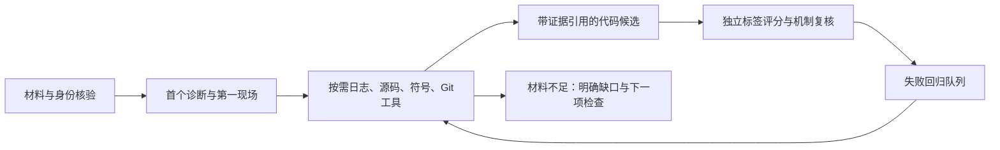

# Kernel 定位闭环（2026-10-07）

本轮重心从网站功能转到定位能力。运行链为：完整性门禁 → 输入缺失识别 → 第一现场定界 → 工具取证 → 候选代码定位 → 独立评分/人工机制审核 → 失败归档与回归。模型输出“高置信度”不构成根因证明。



## 数据集

服务器数据根目录：`/root/gpufree-data/kernel-insight-lab/datasets/stability-v1`。68 个真实 QEMU TCG 场景，当前 60 个有效样本（59 个故障、1 个健康基线）；8 个未达到预期诊断要求的场景保留原始材料并排除评分。完整性校验覆盖 423 个文件，无错误。

内核为 OpenHarmony 5.10.210+，commit `f88704ae607f90518f67aee33790ac06d6ada77d` **加 KASAN 本地补丁**，不是该 commit 的干净构建。Build ID `4bae92d13e7edbe54f2de539b0aef72c89615511`。每个有效样本的运行内核 GNU notes 都与冻结 vmlinux 匹配。

统一格式 `kernel-stability-dataset/v1`：

```text
manifest.json                  # evaluator 所有，禁止给 agent
validation.json
shared/                        # vmlinux、bzImage、模块、配置、System.map
                               # 源码快照/补丁、构建日志、编译器/QEMU版本、采集器、initramfs
cases/<id>/serial.log           # 原始完整 console 字节
           agent.log            # 去掉采集器答案提示，保留原始行号
           run.json             # 命令、退出码、停止原因、耗时、运行 Build ID
           ground-truth.json    # 因果实现、函数范围、逐行诊断证据，仅 evaluator
           causal-source.c      # 对应源码完整文件，仅 evaluator
           case.json
```

日志、产物、源码共有 7 种非空输入组合。完整样本的材料始终保留；缺失仅发生在导出的 agent 视图。`kernel-dataset.py validate ROOT` 深度检查 SHA256、路径、运行身份、诊断证据、源代码范围、隔离参数与覆盖范围；`export ROOT --case ID --profile log --destination NEW_DIR` 只导出指定输入，不复制标签或场景名。

扩增通过 `collect_dataset.py --lab LAB --output NEW_DATASET` 生成独立数据版本；中断但未生成 manifest 的目录可续跑，已采集 case 不重复执行；已封版目录拒绝覆盖。注入仅在无网络、无宿主目录共享、2 GiB/2 vCPU 的客体执行，最多并发 4 个。KVM 实测无权限，因此使用 TCG。超时、触发失败或只有非预期次生诊断均排除。原始历史采集目录保持不动。

这些是人工故障注入样本，函数名可能直接提示错误机制，不能把其成绩外推为生产故障定位准确率。vmcore 未采集，完整性是日志/编译产物/源码合同的完整性。提交引入标签也不存在；该集合只评代码位置，不评引入提交。

## Agent

`scripts/localization_agent.py` 实现有预算的真实模型工具循环，同时支持 OpenAI-compatible 与 Ollama 原生接口。8 种工具：`incident`、`log_read`、`log_search`、`source_search`、`source_read`、`symbolize`、`git_history`、`git_show`。工具参数是结构化字段，没有任意 shell 执行入口。原始行号、命令结果、错误与用时保存在 `localization-trace.json`。源码搜索返回内容及文件名命中，便于由进程名追查用户态压测程序。

第一阶段输出 `firstScene`：boot/runtime/shutdown/build/unknown、报错组件、受影响组件、CPU/任务/访问点描述及工具证据。必须区别 KASAN/lockdep 等检测器、故障代码所有者和 panic 后果。

第二阶段输出 `localization`：错误机制、日志中出现的候选函数、实际读取过的源码位置、提交候选、材料缺口及下一项可证伪检查。代码位置必须落在工具返回的源码切片里；凭空代码行和没有读取补丁的提交声明会被移除。Git 仅用于单独确认过的本地历史。即使读过补丁，引入提交仍标记 candidate_unverified，需要区间复现/bisect 等因果验证。

符号工具仅在运行 Build ID 与 ELF 一致时解码 symbol+offset；关闭 GDB 自动加载，不执行目标程序。模块需独立运行身份，不能拿内核 Build ID 替代。缺少匹配产物时保留缺口；没有日志而只有同一构建的源码和产物时，无法区分各故障实例，应拒绝猜测。

网站后端新增可选 `KERNEL_AGENT_ENGINE=closed-loop`，保留原 dsh 路径；新报告字段与真实请求指标可随任务返回。生产切换需先完成模型回归；本轮实验在独立目录，不修改模型服务和现有线上任务。

## 评测及闭环边界

`scripts/run-localization-benchmark.py` 在数据完整性门禁后生成输入视图，标签留在 evaluator。逐例保存报告、模型请求数、工具调用数、定位用时和代码位置命中。实际模型 HTTP 请求（包括失败、格式修复）计为一次模型调用，不能拿 SDK turn 或工具次数代替。用单调时钟统计从模型工具循环开始到结果落盘前的分析耗时，不含网站任务排队、故障注入和材料准备；模型服务内部排队包含在 HTTP 耗时内。新版本逐请求记录耗时和实际 token/生成时长元数据，避免把服务排队误认为工具慢。

代码命中要求路径、函数和代码区间匹配；函数命中单独记录。错误机制正确性需要人工复核，暂为 null；没有提交引入标签时提交准确率也是 null。失败必须计入分母。不同输入组合的分数必须分开报告；无日志的同构材料只评缺口识别与拒答，不与有日志的定位准确率混算。

初轮真实运行若耗尽工具预算仍不交报告，按失败保留，而不是回退生成“成功”。此问题已用于修正 agent：最后一次模型请求禁用工具并要求 JSON 收敛，形成可回归的失败样本。下一步因果闭环是由受控复现器验证修复前后差异；当前只完成取证、候选定位、独立评分与失败回归，不自动修改或执行被分析代码。

`review-localization.py` 接收独立复核结果，要求同一数据指纹、复核者、因果依据和报告证据引用；缺少复核保持 unknown，失败结论进入 regressionQueue。原模型结果和复核输入都保留，输出到新文件。类别命中不能自动填成机制正确。

首错提取曾将正常 `printk: debug:` 中的 `bug:` 子串当成故障，已增加单词边界和初始化负例测试。27 份标注含有这个无关证据行，清理后都仍有真实诊断，60 个有效样本数量未变。原标注保存在服务器 `annotation-history/v1`，当前 v2 标注同时保存准确的因果代码片段；`audit_annotations.py` 可复现该修正。

OOM 首现场使用 `invoked oom-killer`，而不是末尾的 panic；kmemleak 使用首个非零疑似泄漏报告。已读取源码后可收敛为紧凑 JSON Schema 报告，复杂问题可配置 `fastFinal=false` 保留多轮取证；快速收敛不是因果证明。没有日志时停止推断实例，没有源码时停止提供源码工具，没有独立确认的 Git 历史时停止提供 Git 工具。

`--eager-boundary` 先直接执行只读 `incident` 工具，将首个诊断及原始行号立即发送到任务进度，再交给模型做组件/机制推理和工具选取。自动预检与模型工具调用分开计量，`firstSceneSeconds` 只记录实际发现诊断的时间；没有日志或没有诊断时为 null。健康候选同时给出日志总行数和尾部，防止把工具窗口受限误称为原日志截断。网站可选 closed-loop 模式默认使用这条预检路径。

Ollama 原生模式通过 `--transport ollama-native --base http://127.0.0.1:11434` 使用显式 `think=false`，保留同一模型权重，不改线上服务。接口格式依据 [Ollama 工具调用](https://docs.ollama.com/capabilities/tool-calling)、[thinking 控制](https://docs.ollama.com/capabilities/thinking) 与 [结构化输出](https://docs.ollama.com/capabilities/structured-outputs)。协议测试只模拟 HTTP，实际模型成绩单独记录。

## 2026-10-07 真实模型试跑结果

完整报告见 [分版本成绩与回归项](kernel-localization-benchmark-20261007.json)。这是代表性试跑，尚未覆盖全部 60 个有效样本的 7 种输入组合；不同版本、重试结果分别报告，不能挑最好结果合并为总准确率。

| 实验 | 输入与范围 | 报告完成 | 代码位置命中 | 模型请求 / 总分析秒数 |
| --- | --- | --- | --- | --- |
| v6 首轮 | 6 例 × 全材料/仅日志 | 9/12 | 全材料故障 2/5，40%；超时计失败 | 37 / 1202.213 |
| v6 缺失材料 | UAF 的其他 5 种组合 | 4/5 | 日志+源码 0/1，超时；无日志 3 种均明确材料不足 | 12 / 448.593 |
| v8 原生接口复跑 | 锁依赖、原子上下文睡眠、OOM，全材料 | 3/3 | 2/3；OOM 未定位因果代码 | 14 / 388.020 |
| v9 首现场预检 | UAF 日志+源码、仅日志 | 2/2 | 日志+源码 1/1；仅日志只给函数候选 | 4 / 85.337 |

v9 日志+源码例：首个诊断提取 0.0047 秒，3 次模型请求，53.539 秒完成源码定位；仅日志例为 0.0049 秒、1 次请求、31.798 秒。毫秒数仅表示确定性工具提取首个诊断，不表示模型已完成阶段/组件推理或根因分析。v8 锁依赖与原子上下文睡眠分别用了 4 次请求、111.309 / 129.915 秒。接口请求中还包含模型服务排队与预填充，不能把全部时间归为模型生成。

四轮原始 evaluator JSON 均已下载并记录 SHA256、实际 agent hash；此前 SSH 拒绝连接造成的 v8/v9 证据缺口已在后续核查关闭，另取回 5 份工具调用轨迹。后续服务器核查发现网站及项目 Supervisor 停止，平台模型端点正常，详见 [服务器数据集实查](server-dataset-inventory-20261007.json)。

当前开放回归项：保留 4 次历史超时；OOM 虽已找到 invoked oom-killer 第一现场，仍未命中用户态 pressure 分配循环的因果源码。引入提交准确率与独立机制准确率保持 null；源码命中不自动视为根因已验证。网站只增加可选引擎接入，本轮没有切换线上引擎。

本轮代码验证：Python 27/27，Node 31/31 通过。独立复核从 [空白模板](localization-review-template.json) 开始，每项填写 caseId、profile、reviewer、basis、evidenceRefs、mechanismCorrect，使用 `review-localization.py --results RESULTS --reviews REVIEWS --output NEW_RESULTS` 产生新结果，保留原证据。后续应先回归 OOM，再固定代码版本扩展全量评测与受控修复复现。

## 网站接入与下一轮配对迭代

网站现已恢复并启用 closed-loop 原生接口，新增仅由日志任务名/栈帧引导的有界源码预检。同组 6 例结果为 3/5→5/5 代码命中、21→6 次模型请求、181.347→95.834 秒；额外 3 例只命中 2/3，RCU stall 保留为开放回归。网站各业务链路、自检命令和完整证据见 [自检手册](WEBSITE_SELFCHECK.md)、[验收](website-acceptance-20261007.json) 与 [配对数据](agent-iteration-20261007.json)。先前“新引擎未切换线上”的段落是此前阶段状态，现由本段及 handover 最新记录覆盖。
