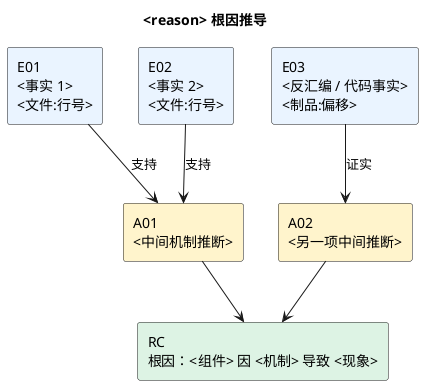

# Kernel 问题定位报告输出模板

> **用途**：这是网站中 Agent 生成 Kernel / 驱动 / 启动异常定位报告的统一模板。它服务于读者的决策，而不是记录 Agent 的工作流水账。
>
> **阅读顺序**：先看“结论先行”判断是否需要行动；再看“证据链与推理”核对依据；最后按“修复与验证”推进闭环。

---

## 生成前的规则

| 原则 | 要求 |
|---|---|
| 结论先行 | 标题下必须给出一句话结论、影响范围和行动建议；不能让读者读完日志才知道发生了什么。 |
| 证据可追溯 | 每一条关键判断都引用 `E##`；每个 `E##` 都必须能定位到 `文件名:行号`、`制品:偏移` 或可复现命令。 |
| 区分事实与推断 | 原始日志、寄存器、反汇编是“事实”；由其导出的机制是“推断”。用“已证实 / 推断 / 待验证”明确标记。 |
| 少而关键 | 正文保留 5–8 条核心证据。完整日志、长调用栈、反汇编放进 `<details>` 折叠区或附录。 |
| 不制造确定性 | 没有源码、符号或复现时，要写清楚缺口；不得用“根因已定位”掩盖“仅有相关性”。 |
| 条件化输出 | 没有符号表、重复复现或补采项时，删除相应小节，不要输出空表、`N/A` 堆叠或无意义的占位文字。 |

### 状态定义

报告状态由三个彼此独立的维度组成，**不要用一个 verdict 混淆它们**：

| 维度 | 可用值 | 含义 |
|---|---|---|
| 框架覆盖 | `已覆盖` / `未覆盖` | 现象能否落入现有决策树或评分规则；它不等同于证据强弱。 |
| 证据置信度 | `高` / `中` / `低` | 当前证据是否足以支持技术判断。 |
| 处置建议 | `可直接修复` / `先补证` / `仅作线索` | 读者现在应采取的动作。 |

> ⚠️ **框架未覆盖 ≠ 证据不足。** 若反汇编、寄存器和时间关系已经闭合，仍可给出“高置信、可直接修复”的人工技术结论；同时必须保留“框架未覆盖”标记并反馈规则缺口。

---

## 可直接生成的报告

<!--
Agent：从这里开始生成最终报告。替换 <> 中的字段，删除所有不适用小节和本注释。
标题中的 reason 使用原始复位/异常标签；一句话现象用用户能理解的语言描述。
-->

# Kernel 问题定位报告｜`<reason>`

> **一句话结论**：`<组件/函数>` 因 `<直接机制>` 导致 `<可观察现象>`；建议 `<立即动作>`。
>
> **报告状态**：框架覆盖 **<已覆盖/未覆盖>** ｜证据置信度 **<高/中/低>** ｜处置建议 **<可直接修复/先补证/仅作线索>**

| 项目 | 内容 |
|---|---|
| 报告时间 | `<YYYY-MM-DD HH:mm TZ>` |
| 设备 / 平台 | `<platform / board / 版本>` |
| 软件基线 | `<kernel / firmware / build-id>` |
| 发生阶段 | `<boot stage / runtime scenario>` |
| 复现情况 | `<次数/总次数；稳定性；首次发生时间>` |
| 输入范围 | `<日志目录或任务编号；时间窗口>` |
| 符号化基础 | `<制品名、build-id、DWARF 状态>`；无则填“未提供” |

<!-- 仅在输入范围、日志缺失或多份制品容易引起误读时保留。 -->
<details>
<summary>分析范围与限制</summary>

- **已分析**：`<日志 / coredump / ELF / 代码提交>`
- **未获得**：`<缺失输入>`
- **本报告不覆盖**：`<明确不在本次判断范围内的内容>`
</details>

---

## 1. 结论先行

### 1.1 发生了什么

- **触发条件**：`<触发动作、前置状态或时间点>`
- **直接现象**：`<panic / oops / hang / reset / 性能退化>`
- **影响范围**：`<受影响设备、进程、功能、数据风险>`
- **优先级**：**<P0/P1/P2>** — `<为何此优先级>`

### 1.2 关键判断

> ✅ **已证实**：`<由直接证据支持的事实；引用 [E##]>`
>
> 🔎 **技术判断**：`<根因或最强候选；引用 [E##] [E##]>`
>
> ⚠️ **仍待验证**：`<会改变修复方案或置信度的未知项>`

<!-- 若没有未决项，删除第三个引用块。 -->

---

## 2. 现场、触发与影响

### 2.1 场景快照

| 维度 | 观察结果 | 结论 |
|---|---|---|
| 复位 / 异常标签 | `<reason / signal / exception>` | `<标签真实含义，必要时说明它是兜底标签>` |
| 直接触发源 | `<进程退出 / 中断 / 地址异常 / watchdog>` | `<主动原因还是后果>` |
| 崩溃上下文 | `<CPU/线程/进程/驱动/调用路径>` | `<相关组件>` |
| 影响边界 | `<单机 / 某型号 / 全量；是否损坏数据>` | `<已知范围与未知范围>` |

### 2.2 关键事件

<!-- 单次事件使用时间线；两次及以上可比较复现使用“复现对照”。二选一，不能同时堆两张表。 -->

#### 时间线

| 时间 / uptime | 事件 | 证据 | 含义 |
|---|---|---|---|
| `<T-...>` | `<前置条件>` | [E01] | `<为何相关>` |
| `<T0>` | **`<异常或崩溃发生>`** | **[E02]** | **`<直接现象>`** |
| `<T+...>` | `<复位 / 恢复 / 后续动作>` | [E03] | `<后果>` |

> **关键间隔**：`<事件 A>` → `<事件 B>` 为 **`<时长>`**；这说明 / 不足以说明 `<因果关系>`。[E##]

#### 复现对照

| 轮次 | 版本 / 场景 | 共同触发条件 | 共同症状 | 差异 | 结论 |
|---|---|---|---|---|---|
| #1 | `<...>` | `<...>` | `<...>` | `<...>` | `<...>` |
| #2 | `<...>` | `<...>` | `<...>` | `<...>` | `<...>` |

> **共性结论**：`<只陈述跨轮次确实成立的共性；引用 [E##] [E##]>`

---

## 3. 证据链与推理

### 3.1 核心证据

<!-- 正文只保留支撑结论的 5–8 条。E# 全报告唯一、递增；不要把“执行了 grep”当成证据。 -->

| ID | 证据事实 | 来源定位 | 支持的判断 |
|---|---|---|---|
| E01 | `<原始日志 / 寄存器 / 调用栈中的关键事实>` | `<日志文件名:行号>` | `<判断>` |
| E02 | `<关键事实>` | `<日志文件名:行号>` | `<判断>` |
| E03 | `<反汇编或符号化事实>` | `<ELF/镜像名:函数+偏移；命令>` | `<判断>` |
| E04 | `<时间、复现或 coredump 事实>` | `<文件名:行号 / 制品:偏移>` | `<判断>` |

**证据强度说明**：`<哪些证据直接证明、哪些只提供关联；不要只写“证据充足”。>`

### 3.2 根因推导图

<!-- 必出。使用 PlantUML；节点最多 12 个。E# 为事实输入，A# 为推理节点，RC 为最终结论。 -->



> **推导结论**：`<用 1–2 句解释图中的闭环，以及哪一跳仍是推断。>` [E01] [E02] [E03]

### 3.3 原始关键片段

<!-- 仅保留读者需要自行核验的片段；长日志、完整调用栈和完整反汇编都放在 details 内。 -->

<details>
<summary>日志片段：<文件名:起止行></summary>

```text
<保留 5–20 行，突出异常发生点和直接上下文>
```
</details>

<details>
<summary>反汇编 / 符号化片段：<制品名，函数+偏移></summary>

```asm
<只保留崩溃读点、写入来源或释放路径附近的关键指令>
```
</details>

<!-- 无符号表或不涉及指令级判断时，删除第二个 details；不要虚构字段名。 -->

---

## 4. 根因、边界与关联信号

### 4.1 根因说明

**根因**：`<组件 / 函数>` 在 `<条件>` 下因 `<内存、并发、状态机或配置机制>` 造成 `<直接故障>`。[E##] [E##]

**机制链**：

1. `<前置状态或缺陷>` [E##]
2. `<触发动作>` [E##]
3. `<崩溃 / 重置的直接机制>` [E##]
4. `<外部可见结果>` [E##]

### 4.2 边界与关联信号

<!-- 不创建“候选排除”大节。仅解释容易被误认为根因、或会影响修复优先级的信号。 -->

| 信号 / 假设 | 与根因的关系 | 当前结论 | 后续动作 |
|---|---|---|---|
| `<watchdog / warning / 配置缺失等>` | `<直接原因 / 触发条件 / 后果 / 无直接证据>` | `<为何不能当作根因>` [E##] | `<是否需要独立跟进>` |
| `<另一项相关现象>` | `<关系>` | `<结论>` [E##] | `<动作>` |

### 4.3 置信度边界

- **高置信依据**：`<可直接闭合因果链的证据>`
- **不确定性**：`<缺少源码行号、只有单次复现、地址未能符号化等>`
- **结论会被推翻的条件**：`<出现什么新证据时必须重新评估>`

---

## 5. 评估与报告状态

| 维度 | 结果 | 依据 / 解释 |
|---|---|---|
| 框架覆盖 | **<已覆盖 / 未覆盖>** | `<命中的决策树；或未覆盖的 reason、最接近路径及差异>` |
| 自动评分 | **<STRONG / ADEQUATE / WEAK / INSUFFICIENT / 不适用>** | `<评分器结果及限制>` |
| 人工证据置信度 | **<高 / 中 / 低>** | `<闭合链、直接证据、关键缺口>` |
| 处置建议 | **<可直接修复 / 先补证 / 仅作线索>** | `<为什么现在可以/不可以派修>` |

> **状态解释**：`<若自动评分与人工判断不同，必须解释差异。例如：框架未覆盖导致自动评分不适用，但符号、反汇编和时间线已经支持高置信技术结论。>`

<!-- 仅在未覆盖时保留。 -->
> 🧩 **框架反馈**：建议为 `<现象 / reason>` 补充 `<决策树分支、评分项或解析规则>`；本案与 `<最接近路径>` 的差异是 `<具体字段或机制>`。

---

## 6. 修复、验证与交付

### 6.1 修复建议

| 优先级 | 动作 | 责任对象 | 完成标准 |
|---|---|---|---|
| P0 | `<止血 / 回滚 / 禁用触发路径>` | `<团队或角色>` | `<用户影响被阻断的可观察标准>` |
| P1 | `<永久修复；明确到模块、函数或配置>` | `<维护者>` | `<代码 / 配置变更通过评审>` |
| P1 | `<回归验证>` | `<测试负责人>` | `<覆盖触发路径并满足通过条件>` |

### 6.2 验证计划

1. **环境**：`<硬件、版本、构建配置>`
2. **步骤**：`<可执行、可重复的触发步骤>`
3. **通过标准**：`<异常不再出现；关键日志/计数器/功能恢复的明确阈值>`
4. **回归范围**：`<相邻驱动、启动路径、性能或内存检查>`
5. **回滚条件**：`<出现何种风险时停止发布或回退>`

<!-- 有符号文件且报告依赖符号/反汇编时保留。命令一律用相对报告根目录的路径。 -->
<details>
<summary>符号化复核命令</summary>

```bash
ELF="<relative/path/to/unstripped.elf>"
LOG="<relative/path/to/log.txt>"

# 1. 校验制品身份与目标符号
readelf -n "$ELF"
nm -n "$ELF" | grep -E "<symbol_1>|<symbol_2>"

# 2. 复核崩溃地址与关键偏移
<disassembler-command-using-relative-paths>

# 3. 回查关键日志
grep -nE "<pattern_1>|<pattern_2>" "$LOG"
```
</details>

---

## 7. 待补证与下一步

<!-- 只列会改变根因、修复方案或发布决策的项目；若无阻断项，明确写“无阻断补采项”。 -->

- [ ] **P0｜<补采项>**：`<需要什么>`；用于确认 `<哪个关键判断>`；责任人 `<角色>`。
- [ ] **P1｜<补采项>**：`<需要什么>`；用于降低 `<哪项不确定性>`；责任人 `<角色>`。

> **无需补采**：`<已被等价证据覆盖或与本案无关的项目>`；原因：`<简短理由>`。

---

## 附录 A：证据索引

<!-- 这里可以保留全部证据；正文仅引用其中关键的 5–8 条。 -->

| ID | 类别 | 内容摘要 | 来源定位 | 可靠性 / 备注 |
|---|---|---|---|---|
| E01 | `<日志 / 寄存器 / 栈 / 反汇编 / 复现>` | `<事实摘要>` | `<文件名:行号；或制品:偏移>` | `<直接 / 间接；限制>` |
| E02 | `<...>` | `<...>` | `<...>` | `<...>` |

---

> **报告结论**：**<可直接修复 / 先补证 / 仅作线索>**。`<用一句话复述最终边界；未覆盖或低置信时必须明确写出。>`

---

## 条件分支与填充规范

### 1. 完整定位、部分定位与 halt

| 报告形态 | 适用条件 | 必须输出 | 不应输出 |
|---|---|---|---|
| 完整定位 | 有直接证据能闭合因果链 | §1–§7 + 证据索引 | 无关的原始日志全文 |
| 部分定位 | 已识别故障机制，但根因或修复点未闭合 | §1、§2、§3、§5、§7 | “可直接修复”的表述 |
| halt 骨架 | 日志不足、输入损坏或 Phase 0 禁止继续分析 | 标题、元信息、§1 已知事实、§5 状态、§7 精确补采项 | 根因图、修复方案、虚构评分 |

`halt` 时的最后一行统一为：

> ⚠️ **当前无法形成根因结论。** 已确认 `<已知事实>`；需取得 `<最小补采集>` 后再继续定位。

### 2. 证据与措辞规范

- 用 `[E01]` 绑定正文判断；不要写“见日志”“应该是”“大概率”等无法核验的泛词。
- “**已证实**”只用于原始证据直接证明的事实；“**技术判断**”用于至少两条独立证据支持的推断；“**待验证**”用于会改变结论的缺口。
- `文件名:行号` 是日志首选定位格式，例如 `last_kmsg.txt:1842-1857`。反汇编使用 `kernel.elf:foo+0x2c`；命令行不是 source，必须同时给出制品或日志位置。
- 不把 watchdog、reset reason、coredump 生成成功等“后果”误写成根因。若它只是后果或触发条件，应放在 §4.2。
- 不要重复复制同一事实：§2 说明“何时发生”，§3 说明“凭什么”，§4 说明“为什么发生”，§6 说明“怎么修”。

### 3. 图表与 Markdown 规范

- 标题最多三级：`#` 报告标题、`##` 主问题、`###` 子问题；不要用加粗文字模拟标题。
- 状态使用 **粗体 + emoji**，例如 `✅ 已证实`、`⚠️ 待验证`、`🧩 框架反馈`，让长报告可快速扫读。
- 单次事故用“时间线”；多次复现才用“复现对照”。不要用大表替代因果关系。
- 根因推导图必须为 PlantUML，且每个事实节点带 `E##` 和来源。不要使用 ASCII 箭头图或把长日志塞进节点。
- `<details>` 只承载辅助核验材料，不能藏住根因、影响范围、修复动作或待补证这些关键结论。
- 最终报告中不得包含版本迁移记录、模板设计讨论、Agent 内部工具名或绝对本机路径。
